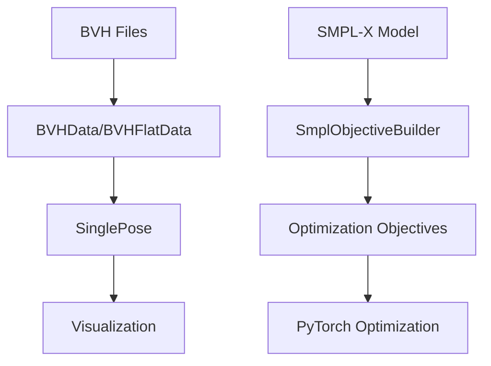

# HumanModelGeneration - hmodel_gen Classes Documentation

Welcome to the comprehensive documentation for the `hmodel_gen` module classes in the HumanModelGeneration project.

## Overview

The `hmodel_gen` module provides essential utilities for working with 3D human models and skeletal animation data. It contains two main components:

### 📊 BVH Parser Module
Parse and manipulate BVH (Biovision Hierarchy) motion capture files with support for:

- **SingleJoint**: Individual joint representation with transformation matrices
- **SinglePose**: Complete pose data for a single frame
- **BVHData**: Standard BVH data with frame-by-frame pose storage
- **BVHFlatData**: Memory-efficient flat storage for large animations

### 🎯 SMPL Objective Builder Module
Build optimization objectives for SMPL-X parametric human models:

- **SmplObjectiveBuilder**: Create PyTorch-based optimization objectives for controlling SMPL-X model parameters

## Quick Navigation

=== "BVH Parser"

    The BVH parser provides classes for loading, manipulating, and visualizing motion capture data:

    - [**BVH Parser Overview**](bvh_parser/index.md) - Module introduction and usage patterns
    - [**SingleJoint**](bvh_parser/single_joint.md) - Individual joint representation
    - [**SinglePose**](bvh_parser/single_pose.md) - Frame-specific pose data
    - [**BVHData**](bvh_parser/bvh_data.md) - Standard BVH data structure
    - [**BVHFlatData**](bvh_parser/bvh_flat_data.md) - Memory-efficient BVH storage

=== "SMPL Objective Builder"

    The SMPL objective builder enables optimization-based control of SMPL-X models:

    - [**SMPL Overview**](smpl_objective_builder/index.md) - Module introduction and concepts
    - [**SmplObjectiveBuilder**](smpl_objective_builder/smpl_objective_builder.md) - Main optimization class

## Key Features

!!! info "BVH Processing"
    
    - Load BVH files with full skeletal hierarchy support
    - Transform coordinate spaces (world vs. parent-relative)
    - Memory-efficient storage for long animations
    - 3D visualization capabilities
    - Bone length manipulation and pose retargeting

!!! success "SMPL-X Integration"
    
    - PyTorch-based optimization objectives
    - Flexible degrees-of-freedom control
    - Keypoint alignment objectives
    - L2 regularization for all parameter types
    - Support for translation, rotation, pose, and shape parameters

## Getting Started

### Prerequisites

```bash
# Activate the conda environment
conda activate ml

# Install dependencies
pip install -e .
```

### Basic Usage Examples

#### Loading BVH Data
```python
from hmodel_gen.bvh_parser import BVHData

# Load BVH file
bvh_data = BVHData.from_file("path/to/motion.bvh")

# Get pose at frame 0
pose = bvh_data.get_pose(0)

# Visualize the pose
plotter = bvh_data.visualize_pose(0, show_axes=True)
```

#### SMPL-X Optimization
```python
import smplx
from hmodel_gen.smpl_objective_builder import SmplObjectiveBuilder

# Create SMPL-X model
model = smplx.create(model_path='path/to/models', 
                     model_type='smplx',
                     gender='neutral')

# Create objective builder
builder = SmplObjectiveBuilder.from_smplx_model(model)

# Enable degrees of freedom
builder.var_translation(True, True, True)
builder.var_pose(True)

# Create keypoint objective
target_points = torch.tensor([[0.0, 1.0, 0.0]])  # Target position
loss = builder.obj_move_keypoints_to([0], target_points)
```

## Architecture

The module follows a clear separation of concerns:



## Documentation Structure

This documentation is organized into logical sections, each covering specific aspects of the classes:

- **Class Overview**: High-level purpose and usage patterns
- **API Reference**: Detailed method documentation with parameters and return values
- **Examples**: Practical usage scenarios with code samples
- **Integration**: How classes work together in typical workflows