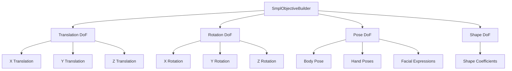

# SMPL Objective Builder Module

The SMPL Objective Builder module provides tools for creating optimization objectives to control SMPL-X parametric 3D human models. This module enables PyTorch-based optimization workflows for pose estimation, motion capture fitting, and character animation.

## Module Overview

The SMPL Objective Builder consists of a single main class that provides a comprehensive interface for building optimization objectives:

### Core Class

| Class | Purpose | Key Features |
|-------|---------|--------------|
| [**SmplObjectiveBuilder**](smpl_objective_builder.md) | Optimization objective construction | DoF control, keypoint objectives, regularization |

## Key Concepts

### SMPL-X Model Integration

The module is designed to work with SMPL-X models from the `smplx` library. SMPL-X is a parametric model that represents the human body using:

- **Shape Parameters (β)**: Control body shape and proportions
- **Pose Parameters (θ)**: Control joint rotations and body pose
- **Translation Parameters**: Control global position
- **Global Orientation**: Control global rotation

### Degrees of Freedom (DoF) Control

The objective builder provides fine-grained control over which parameters can vary during optimization:



### Optimization Objectives

The module provides several types of objectives that can be combined:

1. **Keypoint Alignment**: Move SMPL keypoints to target 3D positions
2. **L2 Regularization**: Prevent parameters from becoming too large
3. **Custom Objectives**: Extensible framework for additional constraints

## Architecture Pattern

```mermaid
graph LR
    A[SMPL-X Model] --> B[SmplObjectiveBuilder]
    B --> C[DoF Configuration]
    B --> D[Objective Functions]
    
    C --> C1[var_translation()]
    C --> C2[var_rotation()]
    C --> C3[var_pose()]
    C --> C4[var_shape()]
    
    D --> D1[obj_move_keypoints_to()]
    D --> D2[obj_l2_reg_translation()]
    D --> D3[obj_l2_reg_rotation()]
    D --> D4[obj_l2_reg_pose()]
    
    D1 --> E[PyTorch Loss Tensor]
    D2 --> E
    D3 --> E
    D4 --> E
    
    E --> F[Optimizer]
    F --> G[Updated Model Parameters]
```

## Usage Patterns

### Basic Setup

```python
import smplx
import torch
from hmodel_gen.smpl_objective_builder import SmplObjectiveBuilder

# Create SMPL-X model
model = smplx.create(
    model_path='path/to/smplx/models',
    model_type='smplx',
    gender='neutral',
    batch_size=1
)

# Create objective builder
builder = SmplObjectiveBuilder.from_smplx_model(model)
```

### Degrees of Freedom Configuration

```python
# Enable translation in all axes
builder.var_translation(True, True, True)

# Enable rotation around Y-axis only
builder.var_rotation(False, True, False)

# Enable pose variation for all joints
builder.var_pose(True)

# Enable shape variation
builder.var_shape(True)
```

### Objective Construction

```python
# Target keypoint positions
target_positions = torch.tensor([[0.0, 1.8, 0.0]])  # Head at 1.8m height

# Create keypoint objective
keypoint_loss = builder.obj_move_keypoints_to(
    smpl_keypoint_indices=[15],  # Head keypoint
    target_points=target_positions,
    weights=1.0
)

# Add regularization
pose_reg = builder.obj_l2_reg_pose(0.01)  # Small regularization weight
shape_reg = builder.obj_l2_reg_shape(0.1)

# Combine objectives
total_loss = keypoint_loss + pose_reg + shape_reg
```

## Integration Workflows

### Motion Capture Fitting

```python
def fit_mocap_data(mocap_keypoints: torch.Tensor, model: smplx.SMPLX) -> dict:
    """Fit SMPL-X model to motion capture keypoints."""
    builder = SmplObjectiveBuilder.from_smplx_model(model)
    
    # Configure degrees of freedom
    builder.var_translation(True, True, True)
    builder.var_rotation(True, True, True)
    builder.var_pose(True)
    
    # Setup optimizer
    optimizer = torch.optim.Adam([
        model.transl,
        model.global_orient,
        model.body_pose
    ], lr=0.01)
    
    # Optimization loop
    for iteration in range(100):
        optimizer.zero_grad()
        
        # Create objectives
        keypoint_loss = builder.obj_move_keypoints_to(
            smpl_keypoint_indices=list(range(len(mocap_keypoints))),
            target_points=mocap_keypoints,
            weights=1.0
        )
        
        reg_loss = builder.obj_l2_reg_pose(0.01)
        
        total_loss = keypoint_loss + reg_loss
        total_loss.backward()
        optimizer.step()
        
        if iteration % 10 == 0:
            print(f"Iteration {iteration}: Loss = {total_loss.item():.6f}")
    
    return {
        'final_loss': total_loss.item(),
        'model_output': model()
    }
```

### Character Animation

```python
def animate_character(target_sequence: List[torch.Tensor], model: smplx.SMPLX) -> List[dict]:
    """Animate SMPL-X character to follow target keypoint sequence."""
    builder = SmplObjectiveBuilder.from_smplx_model(model)
    builder.var_pose(True)
    
    results = []
    
    for frame_idx, frame_targets in enumerate(target_sequence):
        # Reset pose for each frame
        model.body_pose.data.zero_()
        
        optimizer = torch.optim.LBFGS([model.body_pose], lr=0.1)
        
        def closure():
            optimizer.zero_grad()
            loss = builder.obj_move_keypoints_to(
                smpl_keypoint_indices=[15, 20, 21],  # Head, hands
                target_points=frame_targets,
                weights=torch.tensor([1.0, 0.5, 0.5])
            )
            loss.backward()
            return loss
        
        optimizer.step(closure)
        
        # Store results
        model_output = model()
        results.append({
            'frame': frame_idx,
            'vertices': model_output.vertices.detach(),
            'joints': model_output.joints.detach()
        })
    
    return results
```

### Interactive Pose Editing

```python
class InteractivePoseEditor:
    """Interactive SMPL-X pose editor using objectives."""
    
    def __init__(self, model: smplx.SMPLX):
        self.model = model
        self.builder = SmplObjectiveBuilder.from_smplx_model(model)
        self.constraints = []
    
    def add_keypoint_constraint(self, joint_idx: int, target_pos: torch.Tensor, weight: float = 1.0):
        """Add a keypoint position constraint."""
        self.constraints.append({
            'type': 'keypoint',
            'joint_idx': joint_idx,
            'target_pos': target_pos,
            'weight': weight
        })
    
    def solve_constraints(self, max_iterations: int = 50):
        """Solve all active constraints."""
        if not self.constraints:
            return
        
        # Enable pose variation
        self.builder.var_pose(True)
        
        optimizer = torch.optim.Adam([self.model.body_pose], lr=0.01)
        
        for iteration in range(max_iterations):
            optimizer.zero_grad()
            
            total_loss = torch.tensor(0.0)
            
            # Process keypoint constraints
            for constraint in self.constraints:
                if constraint['type'] == 'keypoint':
                    loss = self.builder.obj_move_keypoints_to(
                        smpl_keypoint_indices=[constraint['joint_idx']],
                        target_points=constraint['target_pos'].unsqueeze(0),
                        weights=constraint['weight']
                    )
                    total_loss += loss
            
            # Add regularization
            reg_loss = self.builder.obj_l2_reg_pose(0.01)
            total_loss += reg_loss
            
            total_loss.backward()
            optimizer.step()
        
        return total_loss.item()
    
    def clear_constraints(self):
        """Clear all constraints."""
        self.constraints.clear()

# Usage
editor = InteractivePoseEditor(model)
editor.add_keypoint_constraint(15, torch.tensor([0.0, 1.8, 0.0]))  # Head position
editor.add_keypoint_constraint(20, torch.tensor([0.5, 1.0, 0.0]))  # Right hand
final_loss = editor.solve_constraints()
```

## Optimization Strategies

### Hierarchical Optimization

```python
def hierarchical_optimization(builder: SmplObjectiveBuilder, targets: dict) -> dict:
    """Optimize SMPL-X parameters in stages."""
    
    # Stage 1: Global positioning
    builder.var_translation(True, True, True)
    builder.var_rotation(True, True, True)
    builder.var_pose(False)
    builder.var_shape(False)
    
    global_optimizer = torch.optim.Adam([
        builder.model.transl,
        builder.model.global_orient
    ], lr=0.1)
    
    # Optimize global pose
    for _ in range(20):
        global_optimizer.zero_grad()
        loss = builder.obj_move_keypoints_to(
            targets['keypoint_indices'],
            targets['positions'],
            weights=1.0
        )
        loss.backward()
        global_optimizer.step()
    
    # Stage 2: Detailed pose
    builder.var_pose(True)
    
    pose_optimizer = torch.optim.Adam([builder.model.body_pose], lr=0.01)
    
    for _ in range(50):
        pose_optimizer.zero_grad()
        
        keypoint_loss = builder.obj_move_keypoints_to(
            targets['keypoint_indices'],
            targets['positions'],
            weights=1.0
        )
        
        reg_loss = builder.obj_l2_reg_pose(0.01)
        
        total_loss = keypoint_loss + reg_loss
        total_loss.backward()
        pose_optimizer.step()
    
    # Stage 3: Shape refinement (if needed)
    if 'enable_shape' in targets and targets['enable_shape']:
        builder.var_shape(True)
        
        shape_optimizer = torch.optim.Adam([builder.model.betas], lr=0.001)
        
        for _ in range(30):
            shape_optimizer.zero_grad()
            
            keypoint_loss = builder.obj_move_keypoints_to(
                targets['keypoint_indices'],
                targets['positions'],
                weights=1.0
            )
            
            shape_reg = builder.obj_l2_reg_shape(0.1)
            
            total_loss = keypoint_loss + shape_reg
            total_loss.backward()
            shape_optimizer.step()
    
    return {
        'model_output': builder.model(),
        'final_parameters': {
            'translation': builder.model.transl.detach(),
            'rotation': builder.model.global_orient.detach(),
            'pose': builder.model.body_pose.detach(),
            'shape': builder.model.betas.detach() if hasattr(builder.model, 'betas') else None
        }
    }
```

## Advanced Techniques

### Gradient-Based IK Solving

```python
def solve_inverse_kinematics(builder: SmplObjectiveBuilder, 
                           end_effector_joints: List[int],
                           target_positions: torch.Tensor,
                           max_iterations: int = 100) -> dict:
    """Solve inverse kinematics using gradient-based optimization."""
    
    # Enable only pose parameters
    builder.var_translation(False, False, False)
    builder.var_rotation(False, False, False)
    builder.var_pose(True)
    builder.var_shape(False)
    
    # Use L-BFGS for better convergence
    optimizer = torch.optim.LBFGS([builder.model.body_pose], lr=0.1)
    
    def closure():
        optimizer.zero_grad()
        
        # Primary objective: reach targets
        ik_loss = builder.obj_move_keypoints_to(
            smpl_keypoint_indices=end_effector_joints,
            target_points=target_positions,
            weights=1.0
        )
        
        # Secondary objective: maintain natural pose
        reg_loss = builder.obj_l2_reg_pose(0.01)
        
        total_loss = ik_loss + reg_loss
        total_loss.backward()
        
        return total_loss
    
    # Optimization loop
    for iteration in range(max_iterations):
        loss = optimizer.step(closure)
        
        if iteration % 10 == 0:
            print(f"IK Iteration {iteration}: Loss = {loss.item():.6f}")
    
    # Evaluate final result
    model_output = builder.model()
    final_positions = model_output.joints[0, end_effector_joints, :]
    
    errors = torch.norm(final_positions - target_positions, dim=1)
    
    return {
        'success': torch.all(errors < 0.05),  # 5cm threshold
        'errors': errors,
        'final_positions': final_positions,
        'target_positions': target_positions,
        'model_output': model_output
    }
```

## Best Practices

!!! tip "Optimization Setup"
    - Start with global positioning before detailed pose optimization
    - Use appropriate learning rates for different parameter types
    - Combine multiple objectives with carefully tuned weights
    - Enable only necessary degrees of freedom for faster convergence

!!! warning "Gradient Flow"
    - Ensure all optimized parameters have `requires_grad=True`
    - Use the builder's DoF methods to automatically set gradient requirements
    - Avoid optimizing parameters that are not enabled in the builder

!!! info "Regularization"
    - Always include regularization terms to prevent overfitting
    - Use smaller weights for regularization compared to primary objectives
    - Shape regularization is particularly important to maintain realistic body proportions

## Common Use Cases

### Pose Estimation from Images
- Configure translation, rotation, and pose DoF
- Use keypoint detection results as target positions
- Add strong regularization to maintain realistic poses

### Motion Retargeting
- Load source animation with BVH parser
- Extract keypoint trajectories per frame
- Optimize SMPL-X pose to match keypoints while preserving motion style

### Interactive Character Control
- Enable specific DoF based on user interaction mode
- Use real-time optimization for responsive control
- Implement constraint prioritization for complex interactions

### Physics Simulation Integration
- Use SMPL-X as character representation in physics engine
- Apply constraints from collision detection and contact forces
- Maintain character proportions while respecting physical constraints

## Integration with Other Modules

The SMPL Objective Builder integrates seamlessly with other components:

- **BVH Parser**: Use motion capture data to drive SMPL-X optimization
- **Blender Integration**: Export optimized SMPL-X poses back to Blender
- **Visualization**: Render optimization results using `igpy` visualization tools
- **Analysis**: Combine with motion analysis tools for performance evaluation